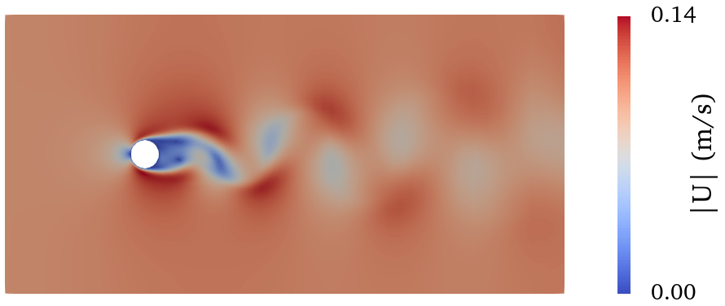
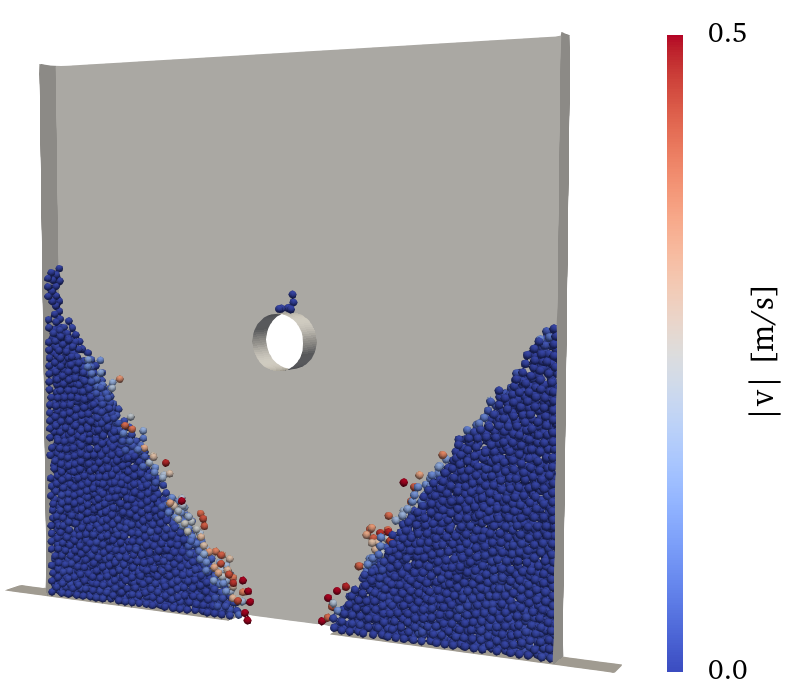
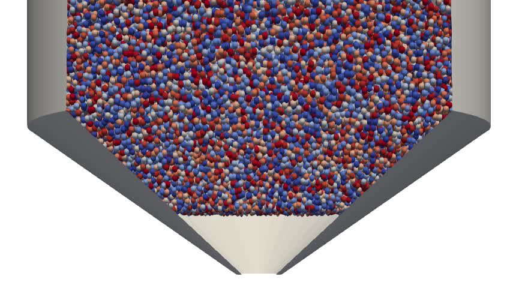
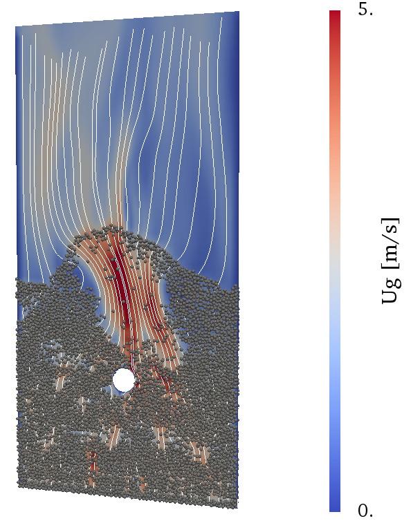

# ParticleSimulations-course-tutorials
Tutorial cases for the lecture 'Introduction to Particle Simulation' at JKU.

## Fluid test case

Vortex shedding after a cylinder at Re = 200 computed with OpenFOAM. After a spin-up phase, a periodic Kármán vortex street develops.

## Particles test case

Particles settling in a box with an obstacle and draining through a hole in the bottom. After sufficient time, only particles in the corners remain in the domain and demonstrate the material's angle of repose.

Initial state of a hopper before material reaches the outlet and clogs it within a few time steps. Increasing the outlet diameter or making the walls steeper and/or smoother enhances flowability.

## Particle-fluid test case

A bubbling fluidized bed with an obstacle. The inflow velocity increases from 0 m/s to its final value 1.6 m/s over the course of 1.0 s. First, the particles form a packed, immobile bed. Only when the gas velocity exceeds the fluidization velocity, particles start to move and form a transient pattern of voids and clusters. 
